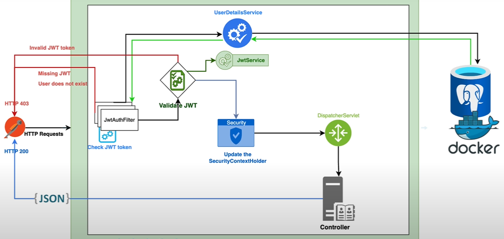

# JWT Authentication/Authorization.

This project serves as an in depth complementary study of JWT and Spring Security.

## Technologies :
- JWT;
- Maven;
- Docker;
- BCrypt;
- PostgreSQL;
- Spring Boot;
- Spring Security.

## Features :
- Refresh token;
- Logout mechanism;
- Password encryption using BCrypt;
- Customized access denied handling;
- Role-based authorization with Spring Security;
- User registration and login with JWT authentication.